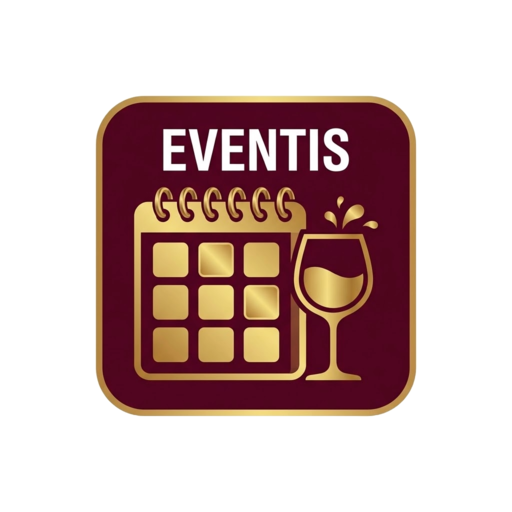

# 🎡 Local Event Radar for Home Assistant

A custom Home Assistant integration that fetches local events, wine festivals, folk fairs (Kirchweih), and concerts within your specified radius and displays them on your dashboard.

## Features
- 📍 **Radius-based filtering**: Set your city/location and search radius in kilometers.
- 🍷 **Category selection**: Filter for Wine Festivals, Kirchweih, Concerts, Markets, etc.
- 📅 **Native HA Calendar**: View events in your HA calendar view.
- 🎨 **Pre-made UI Dashboard Card**: Out-of-the-box Lovelace dashboard card without writing YAML code!

## Installation via HACS

1. Open **HACS** in your Home Assistant.
2. Click the 3 dots in the top right corner and select **Custom repositories**.
3. Paste your GitHub repository URL and select **Integration**.
4. Click **Install**.
5. Restart Home Assistant.
6. Go to **Settings -> Devices & Services -> Add Integration** and search for **Local Event Radar**.

## API Key Setup
Get a free API token from [BayernCloud Tourismus](https://bayerncloud.digital/).
